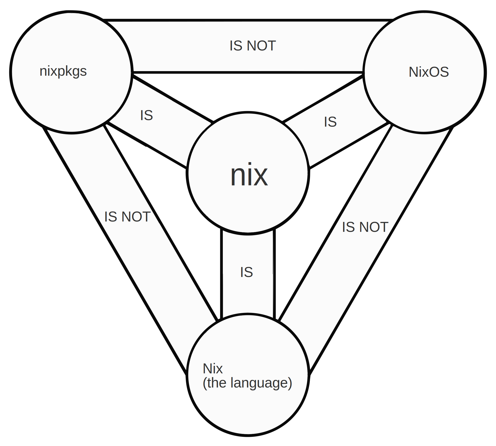

<!-- _class: lead -->

# Nix en DevOps: entornos consistentes y reproducibles sin esfuerzo

## Valencia DevOps, 20/11/2024

---

# $ whoami
🔹 Apasionado del software libre  
🔹 Estudiante de doctorado en la Universidad de Castilla-La Mancha  
🔹 Miembro del Summer of Nix 2024  
🔹 Fediverse: [@amerinor01@mastodon.social](https://mastodon.social/@amerinor01)  
🔹 Matrix: [@amerino:matrix.org](https://matrix.to/#/@amerino:matrix.org)  

---

# ¿Qué es Nix?
  
* Gestor de paquetes  
* Sistema operativo  
* Lenguaje de programación  
* Ecosistema integral diseñado para desarrollar, implementar y gestionar software de forma reproducible  

---

# Orígenes de Nix

- Bases académicas → Resolver los principales problemas en la construcción del software:
    - **Reproducibilidad**: "_Build once, run everywhere_"  
    - **Inmutabilidad**: Garantiza estados idempotentes  
    - **Declarativo**  
- Referencia clave:  
    [Dolstra, E. (2006). *The purely functional software deployment model*.](https://www.semanticscholar.org/paper/The-purely-functional-software-deployment-model-Dolstra/7c9d53d567c4db2034d8019ff11e0eb623fe2142)

---

# ¿Por qué importa a los DevOps?
- Alineación con los principios de CI/CD  
- Elimina el caso de "Funciona en mi máquina"  
- Permite mejores entornos compartidos entre los equipos de desarrollo y operaciones  

---

# Reproducibilidad

- Todo en Nix parte de una derivación  
- Las derivaciones contienen información como:  
    - Dependencias  
    - Instrucciones de compilación/instalación  
    - Versiones y metadatos de la derivación  
- Cada dependencia es una derivación propia  

---

# Reproducibilidad: almacenamiento

- Cada derivación se almacena en `/nix/store/...` con un nombre único basado en el resultado del binario/bibliotecas.  
    - Esto permite que múltiples versiones coexistan sin generar conflictos.  
- Las bibliotecas están aisladas en cada derivación.

---

# Reproducibilidad: aislamiento

- **Aislamiento de red**: Nix bloquea el acceso a internet durante la construcción de paquetes para evitar dependencias no declaradas.  
    - Esto garantiza construcciones reproducibles y sin dependencia del estado externo.  

---

# Nixpkgs
  
- Más de 100,000 paquetes en Nixpkgs  
- Compatibilidad multiplataforma  
- Uso de cachés para acelerar las actualizaciones  

---

# NixOS
- Configuración total del sistema usando expresiones en Nix  
- **Actualizaciones seguras y reversibles**: Las actualizaciones son atómicas, y puedes revertir fácilmente a la configuración anterior  
- Sistema operativo declarativo e [inmutable](https://github.com/nix-community/impermanence)  
- Soporte para entornos heterogéneos:  
    - Permite configurar múltiples dispositivos con diferentes necesidades (HPC, IoT, escritorios)  

---

# Herramientas para CI/CD
- **Hydra**: Construcción de pipelines de CI con Nix  
- **Cachix**: Herramienta de cachés para derivaciones en Nix  

---

# Estandarización del entorno de trabajo con Nix

- **Flakes**: Un estándar moderno para la reproducibilidad y gestión estructurada de proyectos (incluido en Nix).  
- **DevShell**: Crea entornos de desarrollo bajo demanda adaptados a las necesidades del proyecto.  
- **DevBox**: Configura rápidamente espacios de trabajo aislados para pruebas y desarrollo.  
- **Devenv**: Ideal para equipos y flujos de trabajo complejos con servicios.  

---

# Casos de uso avanzados

- [NixOps](https://github.com/NixOS/nixops): Automatización de despliegues  
- Construcción y ejecución de contenedores con [dockerTools](https://nix.dev/tutorials/nixos/building-and-running-docker-images.html)  
- [Colmena](https://github.com/zhaofengli/colmena): Orquestación ligera  
- [Home Manager](https://github.com/nix-community/home-manager): Entornos de usuario declarativos  
- Integraciones con herramientas como [Terraform](https://github.com/stackbuilders/nixpkgs-terraform/), Helm (con [Kubenix](https://kubenix.org/modules/helm/)), etc.  

---

# Demo Time  

---

# Retos y limitaciones

## Adopción en la comunidad
- Tecnología de nicho, pero en auge.  
- Comunidad activa, aunque todavía hay áreas a mejorar, como la documentación.  

## Flakes
- Características experimentales.  
- Aún no están estandarizados.  

---

# Nix en DevOps: entornos consistentes y reproducibles sin esfuerzo

## Valencia DevOps, 20/11/2024

